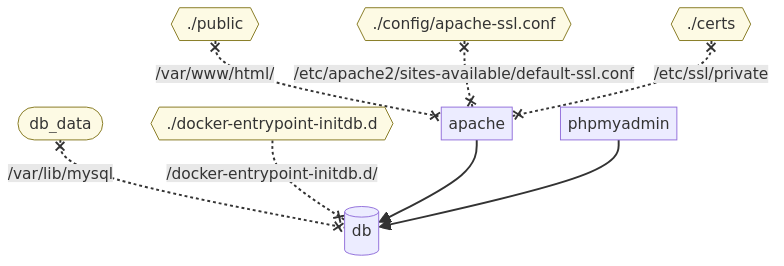

# Group 12 members
- Lukas Galic
- Simon thuresson
- Dominik Völkel
- Brandi MxDermott


# Infrastructure overview:
We decided to use `docker` and `docker compose` in order to set up our infrastructure and to ensure that each member of the team has the same setup.

Essentially there are 3 components:
- A mysql container containing our user data
- A apache instance hosting the actual website (and processing php files)
- A phpmyadmin container connected to the same database for easier setup and maintenance
  - PhpMyAdmin is not necessary for actual operation but was added for easier maintenance/development



The above image is generated with [docker-compose viz](https://derlin.github.io/docker-compose-viz-mermaid/).

The arrows between the (blue) containers indicate dependencies, everything depends on the mysql database.
Apache:
- public php files of our website are inserted into `/var/www/html/` which is the default location for website files for apache
- In order to enable ssl (for common name of "eitf") an `ssl-conf` and certificates are added as well.

db (mysql database)
- The mysql container have a volume `db_data` that writes back to the host system in order to retain information between restarts.
- we also specified an entry-point for the mysql database to automatically initialize the needed user table if it is missing

With that each member works with the exact same technical stack.

## Database setup:
The database only really needs a single table to hold our users data:
```sql
CREATE TABLE `users` (
  `id` int NOT NULL AUTO_INCREMENT,
  `username` varchar(16) NOT NULL,
  `password` varchar(255) NOT NULL,
  `failed_attempts` int NOT NULL DEFAULT '0',
  `home_address` varchar(64) NOT NULL,
  `created_at` timestamp NOT NULL DEFAULT CURRENT_TIMESTAMP,
  PRIMARY KEY (`id`)
) ENGINE=InnoDB DEFAULT CHARSET=utf8mb4 COLLATE=utf8mb4_0900_ai_ci;
```

With this we can easily add information using the users `id` as key from other tables, should we require it later.

# Website overview:

The website itself is as minimal as it could be, there are 4 pages:
- login page: for login with username and password
- registration page: for setting up new accounts
- dashboard: where you can add fruits to your cart
- cart: where you can see what is currently inside your cart

Each page other than login/register have a "logout" button. Additionally if you are not logged in you are automatically redirected to the login page.